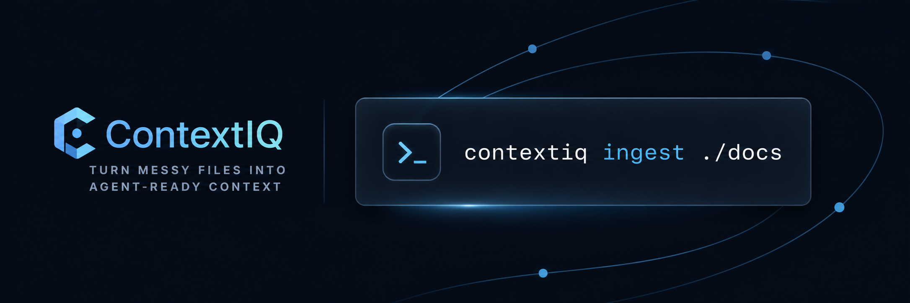

<a href="https://github.com/BASILAHAMED/contextiq">
    
</a>

<br />
<br />

<div align="center">
    <strong>Turn messy files into agent-ready context for RAG, search, and AI workflows.</strong>
    <br />
    <br />
</div>

<div align="center">

[](https://pypi.org/project/contextiq/)
[](https://pypi.org/project/contextiq/)
[](https://github.com/BASILAHAMED/contextiq/blob/main/LICENSE)

<br />

</div>

# ContextIQ

ContextIQ is a local-first ingestion pipeline for developers building RAG systems, agent memory layers, document search, and eval datasets.

Point it at a folder of mixed files and it produces clean, traceable JSONL and Markdown outputs that AI systems can actually use.

## Why ContextIQ

Most AI tooling starts after your data is already clean. Real projects usually break much earlier:

- PDFs are noisy
- Word docs lose structure
- JSON and CSV need normalization
- repos and notes mix formats
- chunks become inconsistent
- source traceability gets lost

ContextIQ focuses on the missing middle: ingestion, normalization, chunking, and export.

## Installation

Install from PyPI:

```bash
pip install contextiq
```

Run the CLI:

```bash
contextiq ingest ./docs --out ./build/context
```

Or with module execution:

```bash
python -m contextiq ingest ./docs --out ./build/context
```

## Quickstart

Use the built-in example content:

```bash
contextiq ingest ./examples --out ./build/context
```

PowerShell example:

```powershell
contextiq ingest .\examples --out .\build\context
```

Generated output:

- `documents.jsonl` - normalized source documents
- `chunks.jsonl` - chunked outputs for RAG and agents
- `chunks.md` - human-readable review output
- `manifest.json` - run summary, warnings, and config

## What It Supports

### Built-in file types

- `.txt`, `.md`, `.rst`
- `.json`, `.jsonl`
- `.csv`, `.tsv`
- `.html`, `.htm`
- optional `.pdf` via `pypdf`
- optional `.docx` via `python-docx`

### Output behavior

- recursive directory ingestion
- normalized plain-text extraction
- document-aware chunking
- source-preserving metadata
- JSONL and Markdown export
- manifest output for reproducibility

## CLI

### Basic usage

```bash
contextiq ingest <path> --out <directory>
```

### Useful flags

- `--include-ext .md,.txt,.json`
- `--exclude-glob "*.min.js,*.lock"`
- `--chunk-size 1200`
- `--chunk-overlap 150`
- `--formats jsonl,markdown`
- `--fail-on-warning`

### Example commands

```bash
contextiq ingest ./docs --out ./dist/context --chunk-size 900 --chunk-overlap 120
```

```bash
contextiq ingest ./knowledge-base --out ./build/export --include-ext .md,.txt,.json
```

## How It Works

ContextIQ runs in four stages:

### 1. Discovery

Recursively finds supported files while skipping common noise such as virtualenvs, caches, and build directories.

### 2. Loading and normalization

Converts each file into normalized plain text:

- Markdown and text are read directly
- JSON and JSONL are pretty-printed into readable text
- CSV and TSV become row-based text
- HTML is stripped to visible text
- PDF and DOCX are supported through optional extras

### 3. Chunking

Splits documents into retrieval-friendly chunks with:

- target chunk size
- overlap between chunks
- paragraph and sentence-aware boundaries
- source path and character ranges preserved

### 4. Export

Writes machine-friendly and human-readable outputs for downstream AI workflows.

## Project Structure

```text
src/contextiq/
|- cli.py
|- pipeline.py
|- loaders.py
|- chunking.py
|- exporters.py
|- discovery.py
|- models.py
`- utils.py
```

## Use Cases

### RAG ingestion

Prepare mixed files for vector indexing and retrieval pipelines.

### Agent memory and context packing

Turn project docs into clean, bounded chunks for coding and research agents.

### Search systems

Produce normalized text and chunk exports for semantic or hybrid retrieval.

### Eval datasets

Create stable, traceable corpora for retrieval benchmarking and prompt evaluation.

## Development

Install editable dependencies:

```bash
pip install -e .[dev]
```

Run tests:

```bash
pytest
```

Run the demo:

```powershell
.\demo.ps1
```

## Roadmap

- embeddings plugin interface
- vector database exporters
- OCR pipeline
- table extraction
- citation-aware retrieval benchmarks

## Contributing

Contributions are welcome.

- improve loaders
- add exporters
- extend chunking strategies
- improve docs and examples

Open an issue or submit a PR if you want to help shape ContextIQ.

## License

MIT License - see [LICENSE](LICENSE)
